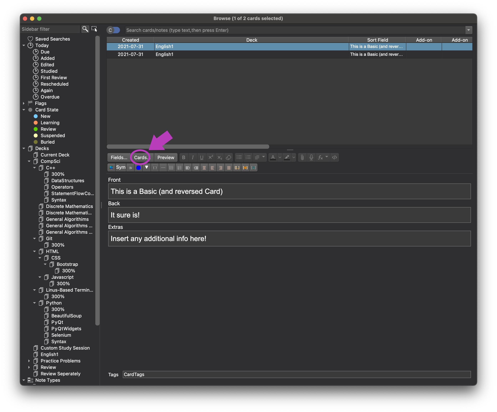
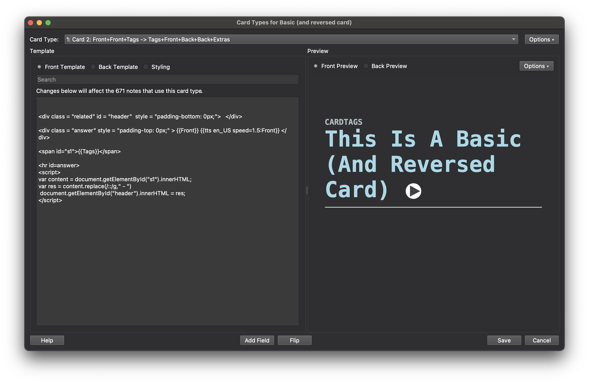

## Installation:

<blockquote> <h4> OPTION #1: </h4> 
Copy and paste the code segments in the section below into your Anki's <i> Basic/Basic & Reversed Template </i>. See below for more instructions </blockquote>


<blockquote> <h4> OPTION #2: </h4> 
Download the pre-made deck from Anki which comes with a seperate template <a href = "https://ankiweb.net/shared/info/1445095567"> here</a> .
Please note that this way will only add the template as a type of card - Previously created cards will look the same
</blockquote>

<p align = "center">


 
 </p>

<blockquote>
<h3 align = "center" style = "color: indianred" > Card 2 Templates are <b> ONLY </b> for Basic And Reversed Card Types. <br> </h3> <p align = "center"> If you only need the template for Basic Card Types, just copy the templates and styling for card 1. </p>
<br>

</blockquote>

## Front Template (Card 1):


```#Copy this into your Front Template tab for Card 1!
<div class = "related" id = "header"  style = "padding-bottom: 0px;">   </div>

<div class = "answer" style = "padding-top: 0px;" > {{Front}} 
 </div> {{tts en_US speed=1.5:Front}}


<hr id=answer>
<span id="s1">{{Tags}}</span>

<script>
var content = document.getElementById("s1").innerHTML;
var res = content.replace(/::/g, " - ")
 document.getElementById("header").innerHTML = res;
</script>


```


## Back Template (Card 1):


```#Copy this into your Back Template tab for Card 1!

<span id="s1">{{Tags}}</span>

<script>
var content = document.getElementById("s1").innerHTML;
var res = content.replace(/::/g, " - ")
 document.getElementById("header").innerHTML = res;
</script>

<div class = "related" id = "header">   </div>

<div class = "answer"> {{Front}} </div>


<hr id=answer>

<div class = "back"> {{Back}} {{tts en_US speed=1.5:Back}} </div> 

<div class = "extras" id = 'extra'> {{Extras}} </div>

```

## Front Template (Card 2)

```#Copy this into your Front Template tab for Card 2 (if you are using Basic and Reversed)!

<div class = "related" id = "header"  style = "padding-bottom: 0px;" >   </div>

<div class = "answer" style = "padding-top: 0px;"> {{Back}} {{tts en_US speed=1.5:Back}}</div>

<span id="s1">{{Tags}}</span>


<hr id=answer>
<script>
var content = document.getElementById("s1").innerHTML;
var res = content.replace(/::/g, " - ")
 document.getElementById("header").innerHTML = res;
</script>

```

## Back Template (Card 2)

```#Copy this into your Back Template tab for Card 2 (if you are using Basic and Reversed)!

<span id="s1">{{Tags}}</span>

<script>
var content = document.getElementById("s1").innerHTML;
var res = content.replace(/::/g, " - ")
 document.getElementById("header").innerHTML = res;
</script>

<div class = "related" id = "header"  style = "padding-bottom: 0px;" >   </div>

<div class = "answer" > {{Back}} </div>

<hr id=answer>

<div class = "back"> {{Front}} 
 {{tts en_US speed=1.5:Front}} </div>

<div class = "extras" id = 'extra'> {{Extras}} </div>

```

## Styling:

```#Copy this into your style tab!

#s1{
display: none;
}

.card {
width: 50%;
font-family: ui-monospace,SFMono-Regular,SF Mono,Menlo,Consolas,Liberation Mono,monospace!important;
font-size: 20px;
padding-top: 200px;
text-align: left;
margin: auto;
}

@media only screen and (max-width: 1000px) {
 .card{
width:90%;
padding: 0px;
padding-top: 100px;

}

}

.related{
font-size: 18px;
font-weight: bold; 
padding-bottom: 4px;
text-transform: uppercase;
font-family: ui-monospace,SFMono-Regular,SF Mono,Menlo,Consolas,Liberation Mono,monospace!important;

}

.night_mode #header {
color: #B1BEC2;
}

#header{
 color: #888484;

}

.card .mobile.night_mode {
color: #B1BEC2;
}


.extras {
font-size: 14px;
padding-top: 10px;
line-height: 2;
font-family :ui-monospace,SFMono-Regular,SF Mono,Menlo,Consolas,Liberation Mono,monospace!important;
}

.night_mode #extra {
	 color: #FBE6CF;
}

.night_mode .answer{
color: lightblue;

}
.answer{
font-size: 50px;
text-transform: capitalize;
color: #38b4e4;
padding-top: 5px;
font-weight: bold;
}


.back {
text-transform: capitalize;
padding-top: 3px;
font-size: 25px;
font-weight: bold;
color: #403c3c;
}

.night_mode .back{
	color: white;

}


 .mobile .answer {
    font-size: 25px;
    }
    
   .mobile .back {
    font-size: 15px;
    }

```


